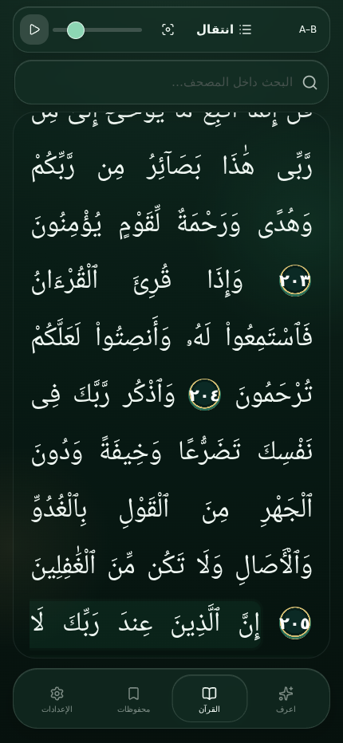
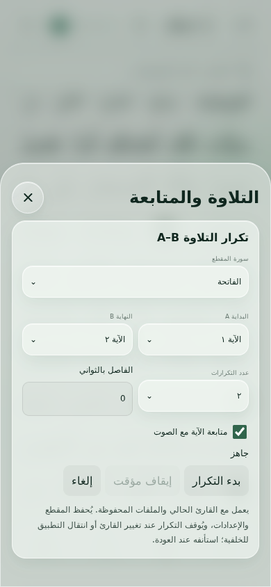
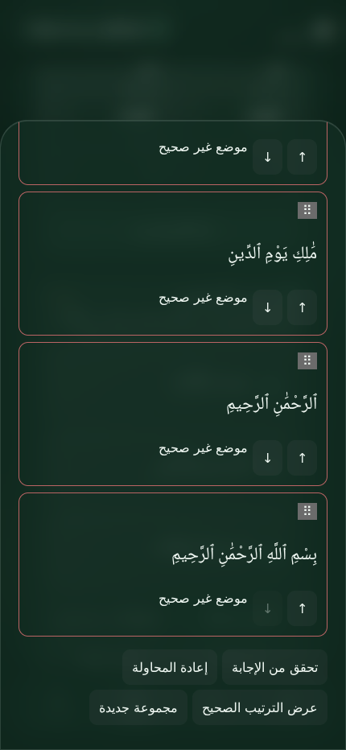
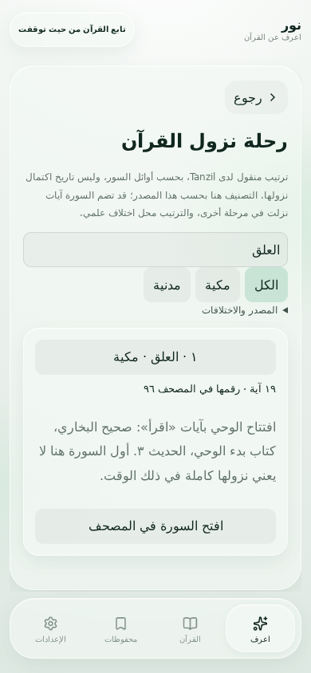
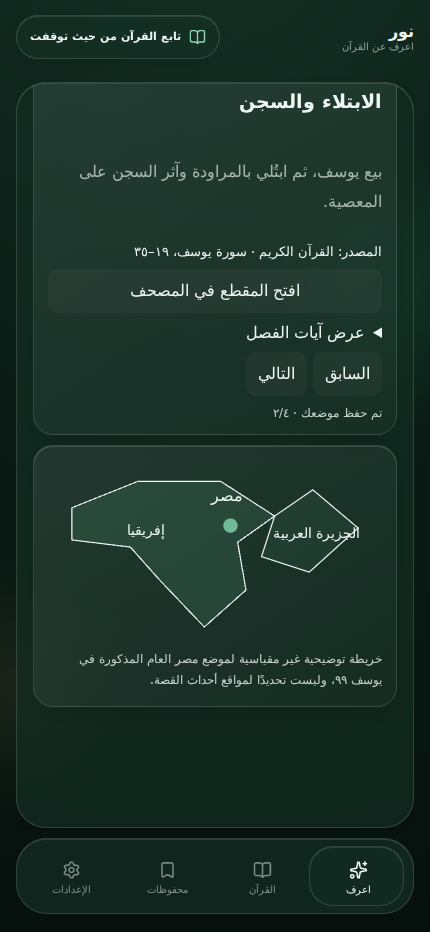

# تقرير اختبار Noor 46

أحدث أساس للمشروع قبل العمل: 6122fbd686e7307ae3571dbb0f58526339d01b4d. أُضيفت الميزات إلى الأقسام الموجودة والمحرك الصوتي الحالي، دون تغيير النص القرآني أو حذف قارئ أو بيانات حفظ.

- إزالة الهامش المحجوز يمين المصحف، ووضع ۩ و۞ داخل النص في مواضعهما من البيانات الموثقة.
- تثبيت خط السجدة في مساحة النص نفسها، مع إعادة قياس الحروف بعد تغيير الخط أو الحجم.
- تكرار A–B بالآيات مع عدد محدد أو مستمر، وفاصل، وإيقاف مؤقت واستئناف وإلغاء، وحفظ الإعدادات.
- متابعة الآية من أحداث مشغل الصوت الفعلية، مع وقف التمرير التلقائي عند تفعيلها.
- اختبار ترتيب الآيات بالسحب أو الأزرار، وتسجيل المحاولة الأولى ضمن خريطة قوة الحفظ.
- رحلة نزول القرآن للـ١١٤ سورة بمصدر Tanzil وبيان الاختلاف، وروابط إلى المصحف.
- ١٥ قصة قرآنية بفصول وآيات ومصادر وحفظ التقدم؛ المحتوى الأساسي يعمل دون الإنترنت.
- قوائم اختيار مستطيلة عمودية قابلة للتمرير، بتصميم Satin Glass، وإصلاح تعارض استعادة القراءة مع روابط الآيات.

التحقق: ٨٥ اختبارًا آليًا، TypeScript، Production Build، سلامة ٦٢٣٦ آية دون اختلاف، و٩٠ حالة عرض لعلامات السجدة. فُحص القراء الخمسة في ١٠ حالات URL/Cache باستخدام ملفات MP3 حقيقية مسترجعة من EveryAyah وتشغيل HTMLAudio فعلي؛ تم الانتقال قرب نهاية الملف للاختبار، ولم تُختلق أحداث انتهاء. رابط URL في الاختبار مُرر بواسطة ملفات المصدر الحقيقية، وليس اختبار شبكة Android.

## قيود مهمة

APK نسخة Debug للاختبار، باسم الحزمة com.noor.quran، ورقم الإصدار 46 (1.4.6). رقم أعلى واسم الحزمة الصحيح لا يكفيان للتحديث: يلزم نفس مفتاح توقيع نسختك المثبتة. المستودع لا يحتوي مفتاحًا محفوظًا، والبناء السابق كان يولّد مفتاح Debug مؤقتًا؛ لذلك لا نضمن التحديث فوق النسخة السابقة. لا تحذف التطبيق المثبت لمجرد تجاوز مشكلة التوقيع.

لم يتوفر هاتف أو محاكي Android لاختبار التثبيت أو الصوت أو الإشعارات فعليًا. نجاح Gradle ليس دليل تشغيل على الهاتف. القراءة المستمرة هي الوضع الحالي؛ وضع الصفحات القديم غير مفعّل ولم يُختبر تشغيله. يتوقف التكرار مؤقتًا عند الخلفية، ويحتاج استئنافًا عند العودة. المطابقة البكسلية التامة لخط المصحف المطبوع ليست معتمدة. خريطة مصر توضيحية غير مقياسية، ولا تحدد مواقع أحداث قصة يوسف.

المصدر: [Tanzil — ترتيب النزول](https://tanzil.net/docs/Revelation_Order). أحداث العلق والفتح: صحيح البخاري 3 و4177. القصص مستخلصة من المقاطع القرآنية الموضحة داخل كل فصل، بلا تواريخ أو مواقع مفترضة.

## تفاصيل القياس

- عرض 390×844 نهاري و430×932 ليلي، بالخـط الافتراضي وأميري وشهرزاد؛ الخطان البديلان فُحصا بتكبير 125%.
- مواضع السجدة الـ15 × 3 خطوط × وضعين = 90 حالة. أكبر اختلاف أفقي لنهاية الخط: 0.503px في البداية و0.421px في النهاية. التفاف في 18 حالة. لا خط مفقود أو عرض سالب أو تمرير أفقي.
- رمزا ۩ و۞ متوفران في ملفات الخطوط الثلاثة. 240 بداية ربع حزب من بيانات المصحف؛ لا إشارات نهاية مخترعة.
- 10 حالات صوت: السديس والمنشاوي والشريم وعلي جابر والدوسري، لكل قارئ مسار URL ومسار CacheStorage. المقطع 1:1–1:2 مرتان، متحققًا من الآية الحالية والتوقف بعد الدورة الثانية. اختبار إيقاف واستئناف فعلي في المتصفح، واختبارات محاكاة منفصلة لأحداث جسر Android والأخطاء والرموز القديمة.
- فحص رحلة النزول وفتح 96:1، والقصص وفتح 12:19 وحفظ الفصل، وترتيب الآيات وملخص المراجعة، في الوضعين. لا عناصر select أصلية.
- بيانات نزول السور طابقت Quran Dataset الحالي 114/114. SHA256 لملف Tanzil metadata: 8867c1d88191472adec9db694b3cd9f135b1a2ef580574d32cf888dcb22c5c7a.

## أدلة قابلة للمراجعة

- [علامات المصحف](qa/release46/marks-runtime.json)
- [الصوت الحقيقي](qa/release46/audio-runtime.json)
- [تنقل وواجهات](qa/release46/features-runtime.json)

## بناء Android

اجتاز التشغيل #174 اختبارات Vitest الـ85 وTypeScript وبناء الويب. نجح Gradle 8.9 في :app:assembleDebug و:app:bundleRelease.

المصدر المختبر: 21b140b75c93b171791dbb02872eb1189f5dea4a.

تشغيل CI: https://github.com/mozico-565/Noor/actions/runs/37989501160

نُشر الإصدار: https://github.com/mozico-565/Noor/releases/tag/noor-release-46

فُحص APK بعد تنزيله: 114060256 بايت، ZIP بلا تلف، com.noor.quran، versionCode 46، versionName 1.4.6. ملفات JavaScript وCSS داخله مطابقة بايتًا للنسخة المختبرة. بيانات القرآن مضمنة ومطابقة.

SHA256 للـAPK: `63c203ceedd948c757869dd2132142e8f32d8811ada239f0c96b9537fd201c2e`، مطابق للبصمة المنشورة في GitHub.

شهادة توقيع APK الجديد SHA256: `6850e2446feb8653eaf08037d826c189918942f5528ab2b4ab087524c22cba5e`.

شهادة APK السابق المتاح (1.4.1 / code 41): `b8450b26e45595c0e848e1026afef3087ca943ea748c2fc5dcfe4a95a178a6d3`.

الشهادتان مختلفتان: هذا APK لا يستطيع تحديث ذلك APK مباشرة. هذا الشرط غير مكتمل ويحتاج المفتاح الخاص الأصلي؛ لا يمكن استرجاعه من APK. لم يُنشأ مفتاح دائم أو تُضاف أسرار حساب دون تفويض.
